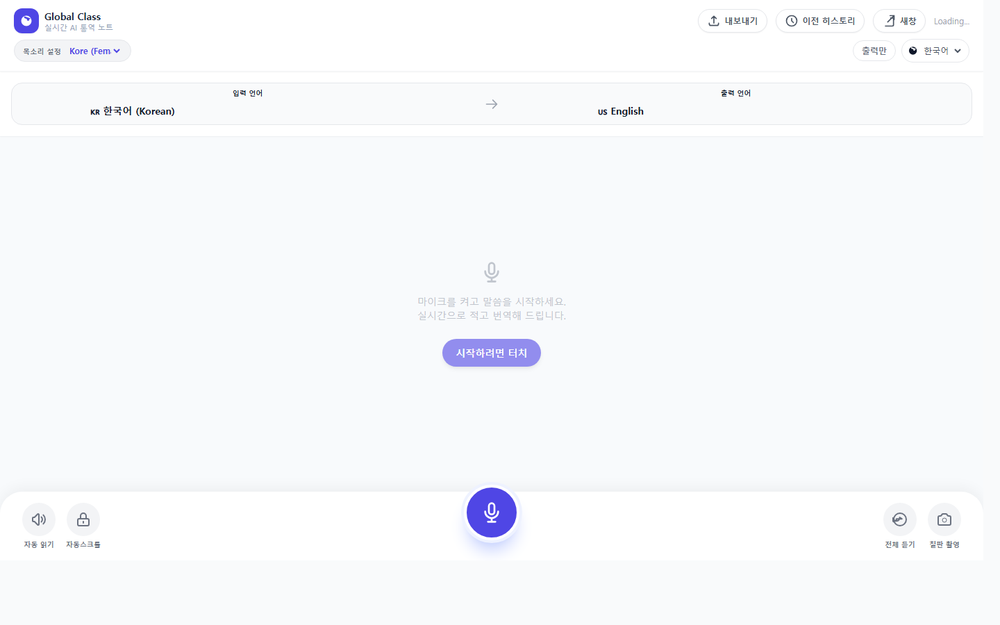
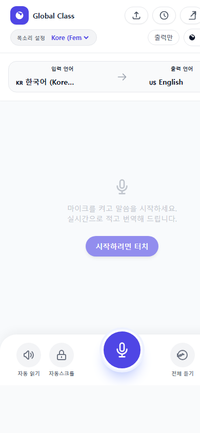

<div align="center">

</div>

# Global Classroom

실시간 음성 인식과 번역, 그리고 Google Workspace(Drive/Docs/Classroom) 내보내기까지 결합한 **AI 기반 다국어 교실 보조 앱**입니다.

교사/학생/강연자/통역 상황에서

- 말한 내용을 실시간으로 기록하고
- 목표 언어로 번역하며
- 필요하면 음성으로 다시 듣고
- 수업이 끝나면 Drive에 “세션” 단위로 백업하고
- 나중에 “대화만/음성까지” 선택해서 복원할 수 있도록

만들었습니다.

## 링크

- 배포(예시): https://7-global-classroom.netlify.app

## 스크린샷

### 데스크톱



### 모바일



## 빠른 기능 요약

- **실시간 음성 → 텍스트(필기) + 번역**
- **자동 언어 감지 + 입력/출력 자동 스왑(수동 변경 전까지)**
- **TTS(음성 합성)**
  - 번역 문장 셀 탭/클릭으로 재생
  - 전체 듣기(순차 재생)
  - 자동 읽기(옵션)
- **카메라(칠판/노트) 텍스트 감지 후 번역**
- **Drive 백업(세션 단위)**
  - transcript/manifest + 문장별 음성(wav)까지 폴더로 저장
- **Drive 세션 복원**
  - “대화만 복원”
  - “음성도 복원”(필요 시 IndexedDB 캐시로 적재)
- **로컬 히스토리**
  - localStorage에 텍스트만 저장
  - 음성은 IndexedDB 캐시(옵션)
- **UI/UX**
  - 출력만 보기(1열)
  - 자동 스크롤(옵션)
  - 프로필 메뉴(설정/로그아웃)

## 사용 시나리오(수업 1시간)

1. 수업 시작 전에 로그인(선택)
2. 마이크를 켜고 수업 진행
3. 번역 결과를 필요할 때마다 탭하여 발음/내용 확인
4. 수업 종료 후
   - Drive로 백업(세션 폴더 생성)
5. 나중에 다시 열어서
   - 이전 히스토리 → Drive 세션 선택
   - 대화만 복원 또는 음성도 복원
   - 전체 듣기로 한 번에 복습

## 데이터 저장 전략

### 왜 localStorage만으로는 부족한가?

브라우저 `localStorage`는 일반적으로 용량이 작고(환경별로 다름) 음성 데이터를 넣기엔 금방 한도를 넘습니다.

그래서 이 앱은 저장소를 역할별로 나눴습니다.

- **텍스트 히스토리(가벼움)**: localStorage
- **문장별 음성 캐시(무거움)**: IndexedDB(브라우저 내장 DB)
- **장기 보관/기기 이동**: Google Drive(세션 폴더 + 파일)

## Drive 백업 포맷(세션)

Drive에 아래 구조로 저장됩니다.

```text
Global Classroom/
  YYYY-MM-DD/
    Session_2025-12-13T21-05-12-123Z/
      transcript.txt
      transcript.json
      manifest.json
      audio/
        0001_<itemId>.wav
        0002_<itemId>.wav
        ...
```

- `transcript.json`: 앱이 복원에 쓰는 대화 데이터
- `manifest.json`: 문장 ID ↔ 음성 파일 ID/순서/목소리/모델 등 메타 정보
- `audio/*.wav`: 문장별 음성 파일

## Drive 복원 UX(이전 히스토리)

`이전 히스토리` 버튼을 누르면

- **Drive 세션 목록**
  - 세션 선택 후
    - `대화만 복원`
    - `음성도 복원`
- **로컬 저장(localStorage)**
  - 불러오기/삭제

로 나뉘어 표시됩니다.

## 아키텍처 개요

### 프론트엔드

- React + Vite

### 서버(배포)

- Netlify Functions(`/api/*`)
  - `/api/live-token`: Gemini Live 임시 토큰 발급
  - `/api/translate`: 번역
  - `/api/tts`: TTS 음성 생성
  - `/api/vision`: 이미지 텍스트 감지/번역
  - `/api/detect-language`: 언어 감지

### 외부 연동

- Google OAuth(GIS)
- Google Drive/Docs/Classroom API

## 설정(프로필 메뉴)

로그인 후 프로필 아이콘을 누르면

- **설정**
  - Drive 백업 방식(수동/자동)
  - 음성 캐시(IndexedDB) 사용 여부
- **로그아웃**

이 제공됩니다.

## 실행/개발

### 요구사항

- Node.js

### 설치

```bash
npm install
```

### 실행

```bash
npm run dev
```

## 환경변수

### 클라이언트(Vite)

- `VITE_GOOGLE_CLIENT_ID`

### Netlify(서버 함수)

- `GEMINI_API_KEY`

## Google OAuth / API 설정

Drive/Docs/Classroom 기능 사용을 위해 Google Cloud Console에서

- OAuth 동의 화면 설정
- 승인된 자바스크립트 원본(서비스 도메인) 추가
- 승인된 리디렉션 URI 추가
- API 활성화
  - Google Drive API
  - Google Docs API
  - Google Classroom API

가 필요합니다.

## 스크린샷 갱신 방법

README용 스크린샷은 `docs/screenshots/`에 저장됩니다.

```powershell
powershell -NoProfile -ExecutionPolicy Bypass -File scripts\capture-screenshots.ps1
```

## FAQ

### 마이크가 안 켜져요

- 브라우저 권한(마이크) 허용 여부를 확인하세요.

### Drive 백업이 실패해요

- Google 로그인 및 Drive 권한(스코프)이 정상적으로 부여되었는지 확인하세요.
- OAuth 설정에서 승인된 도메인/리디렉션 URI가 서비스 주소와 일치해야 합니다.

## 로드맵

- 내보내기 UX 개선: alert → 결과 모달(바로가기 링크 포함)
- Docs/Drive 내보내기에서 결과 URL을 UI로 반환/표시
- Drive 자동 백업 모드 동작 정의 및 안정화

