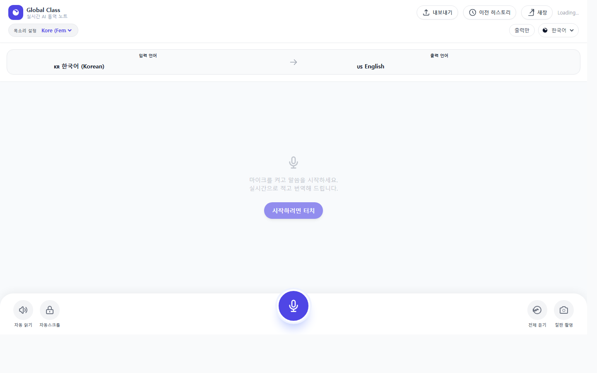
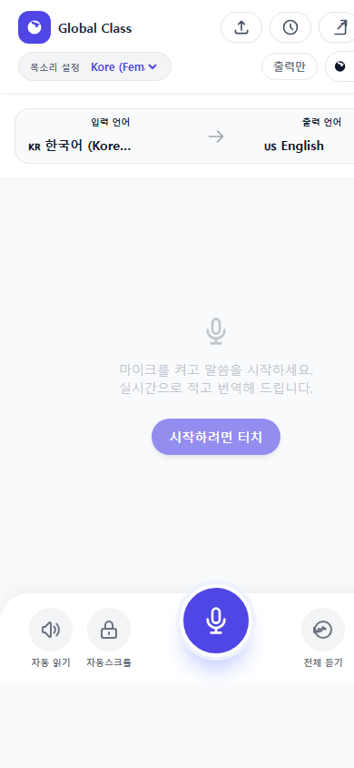
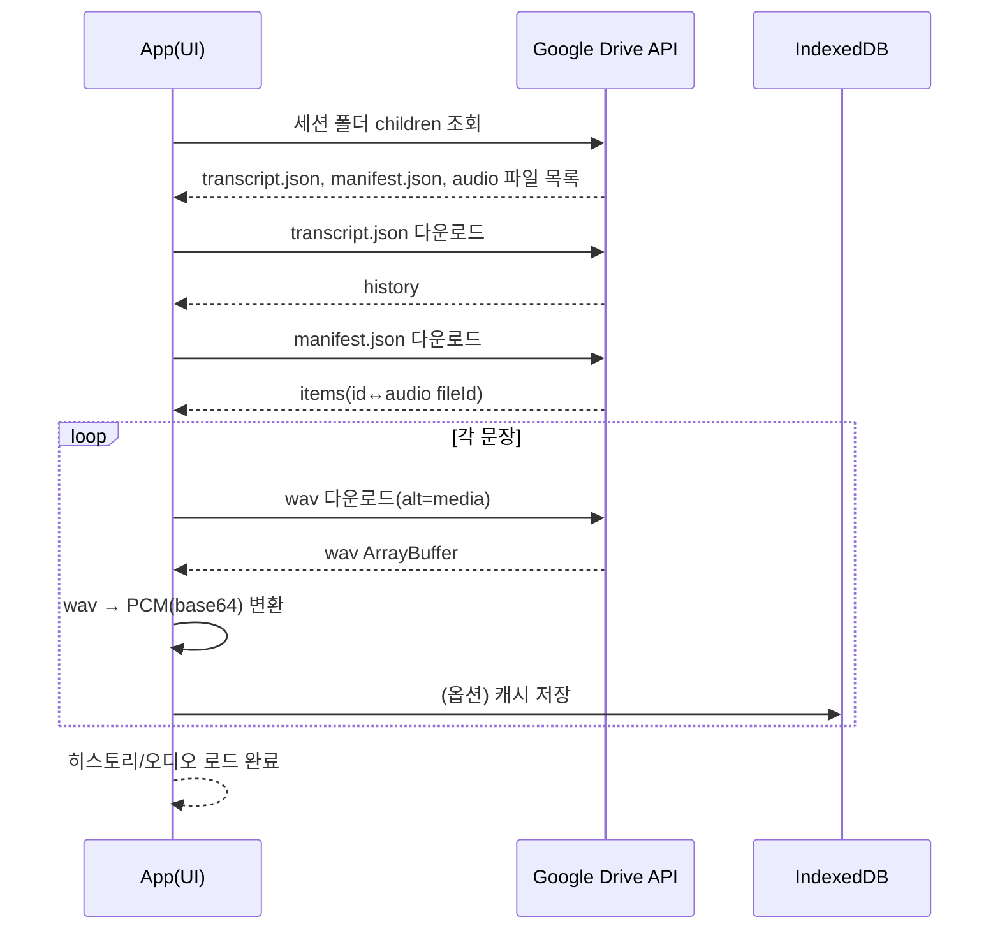

<div align="center">

</div>

# Global Classroom

실시간 음성 인식·번역, AI 인터뷰 통역, 그리고 Google Workspace(Drive/Docs/Classroom) 연동을 결합한 **AI 기반 다국어 커뮤니케이션 앱**입니다. 기존 Global Classroom 화면과 별도로 앱을 하나 더 만드는 방식이 아니라, 같은 UI 안에서 Classroom과 Interview 동작을 전환합니다.

교사/학생/강연자/통역 상황에서

- 말한 내용을 실시간으로 기록하고
- 목표 언어로 번역하며
- 필요하면 음성으로 다시 듣고
- 수업이 끝나면 Drive에 “세션” 단위로 백업하고
- 나중에 “대화만/음성까지” 선택해서 복원할 수 있도록

만들었습니다.

## 링크

- Production: https://7-global-classroom.netlify.app
- AI Interview Interpreter: https://7-global-classroom.netlify.app/?mode=interview

## 운영 권한

- 제품 코드·UI/UX·Interview runtime·제품 이슈의 canonical source는 이 저장소입니다.
- Global Classroom 관련 이슈는 이 저장소의 GitHub Issues에서 관리합니다.
- `skerishKang/ai-revenue-lab`에는 Padiem 공용 플랫폼 연계 이슈만 cross-reference하며 제품 이슈를 중복 생성하지 않습니다.
- 현재 source migration 및 BI 번호 확정은 하지 않습니다.
- 자세한 운영 규칙: [docs/OPERATIONS.md](docs/OPERATIONS.md)

## 스크린샷

### 데스크톱



### 모바일



## 목차

- 개요
- 빠른 기능 요약
- 주요 사용자 시나리오(수업 1시간)
- 기능 상세
  - 실시간 음성 → 텍스트 + 번역
  - 자동 언어 감지 + 입력/출력 자동 스왑
  - TTS(문장 재생/전체 듣기) + 음성 캐시(IndexedDB)
  - 출력만 보기(1열) / 자동 스크롤
  - 카메라(칠판/노트) 텍스트 감지 후 번역
  - Google Workspace 연동(Drive/Docs/Classroom)
- 저장/백업 포맷
  - localStorage
  - IndexedDB
  - Google Drive(세션 폴더)
- Drive 복원 시퀀스(다이어그램)
- OAuth 스코프(권한) 설명
- 프로젝트 구조
- 실행/개발/배포(Netlify)
- 스크린샷 갱신
- FAQ / 로드맵

## 빠른 기능 요약

- **실시간 음성 → 텍스트(필기) + 번역**
- **자동 언어 감지 + 입력/출력 자동 스왑(수동 변경 전까지)**
- **TTS(음성 합성)**
  - 번역 문장 셀 탭/클릭으로 재생
  - 전체 듣기(순차 재생)
  - 자동 읽기(옵션)
- **카메라(칠판/노트) 텍스트 감지 후 번역**
- **Drive 백업(세션 단위)**
  - transcript/manifest + 문장별 음성(wav)까지 폴더로 저장
- **Drive 세션 복원**
  - “대화만 복원”
  - “음성도 복원”(필요 시 IndexedDB 캐시로 적재)
- **로컬 히스토리**
  - localStorage에 텍스트만 저장
  - 음성은 IndexedDB 캐시(옵션)
- **UI/UX**
  - 출력만 보기(1열)
  - 자동 스크롤(옵션)
  - 프로필 메뉴(설정/로그아웃)

## AI Interview Interpreter

Interview 모드는 `?mode=interview`로 진입하며, 기존 Global Classroom UI를 재사용합니다.

**모델별 실제 라우팅과 구형 언어 감지 분리는 [모델·라우팅 기준](docs/MODEL_ROUTES.md)을 참조합니다.** 이 문서는 현재 구현(AS-IS)과 아직 수정하지 않은 목표(TO-BE)를 구분합니다.

현재 Interview 경로의 핵심 동작:

- **음성 원문**: Gemini `gemini-3.5-transcribe-live`를 authoritative transcript로 사용
- **실시간 번역 미리보기**: Gemini `gemini-3.5-live-translate-preview`
- **fallback STT**: Browser SpeechRecognition → Groq Whisper 순으로 전환
- **텍스트 번역/다시 번역**: Groq `openai/gpt-oss-20b` → `openai/gpt-oss-120b` → `qwen/qwen3.8-27b` → Google `gemma-4-26b-a4b-it` → `gemma-4-31b-it` → `gemini-3.5-flash-lite` → `gemini-3.1-flash-lite` 순서. 응답 실패·할당량·타임아웃과 접근성은 [#84](https://github.com/skerishKang/global-classroom/issues/84)에서 별도 추적
- **입력 자동 감지 + 복수 번역 대상**: 기본 KO ↔ EN이며, 감지된 source 언어는 target에서 제외
- **새 행 기본 표시**: source=ko이면 EN, source=en이면 KO를 즉시 표시하고 기존 행의 수동 탭 선택은 유지
- **최종 번역 보장**: Live Translate는 저지연 preview로 사용하고, final translation이 비어 있으면 기존 `/api/translate` 경로로 보완
- **추천 답변**: 확정 전사의 source 언어로 짧은 구어체 답변·내용에 맞는 의견을 번역과 병렬 생성. 음성 확정뿐 아니라 직접 입력/이미지 입력도 동일한 답변 경로를 사용
- **답변 번역**: 선택된 target 언어로 자동 번역하며 utterance별로 캐시. 답변은 기본 접힘이며 `답변 보기`로 펼침
- **키보드 입력**: 왼쪽 composer에서 Enter로 전사 행·번역·답변 생성, Shift+Enter로 줄바꿈
- **이미지 입력**: JPG/PNG/WEBP 업로드, Ctrl+V 붙여넣기, 1프레임 화면 캡처(사용자 권한), 카메라 촬영. 추출 텍스트는 Interview 행·번역·추천 답변으로 이어짐
- **스크롤**: 기본 최신 행 따라가기; 위로 스크롤하면 따라가기 일시 중지; `최신으로` 또는 맨 아래 복귀 시 재개
- **원문/번역 독립 수정**: 원문 수정은 번역을 자동 재작성하지 않으며, 다시 번역은 명시적 사용자 동작
- **대화 기록**: 비로그인 상태에서도 브라우저 localStorage에 텍스트 세션 저장. Gemma 4 31B 우선의 제목·요약 자동 생성 및 저장을 제공(제공자 실패 시 대체 경로 사용)
- **용어집**: 메인 대화 화면이 아니라 Interview 설정에서 관리

Interview의 Live Translate는 발화별 session/context로 격리되어 이전 발화가 다음 번역 행으로 이어지지 않습니다. 선택된 target set에서 source 언어를 제외해 번역하며, 기본 KO ↔ EN 흐름에서는 반대 언어가 추가 클릭 없이 보입니다. Live Translate preview와 final `/api/translate`는 별개 경로이고, 확정 전사의 source 언어로 추천 답변을 생성한 뒤 선택된 target 언어로 자동 번역합니다. **언어 자동 감지의 레거시 모델/404 문제는 아직 미수정이며 [#85](https://github.com/skerishKang/global-classroom/issues/85)에서 추적합니다.**

## 사용 시나리오(수업 1시간)

1. 수업 시작 전에 로그인(선택)
2. 마이크를 켜고 수업 진행
3. 번역 결과를 필요할 때마다 탭하여 발음/내용 확인
4. 수업 종료 후
   - Drive로 백업(세션 폴더 생성)
5. 나중에 다시 열어서
   - 이전 히스토리 → Drive 세션 선택
   - 대화만 복원 또는 음성도 복원
   - 전체 듣기로 한 번에 복습

## 기능 상세

### 실시간 음성 → 텍스트 + 번역

- 마이크를 켜면 음성을 인식해 문장 단위로 기록합니다.
- 각 문장은 원문/번역으로 카드 형태로 누적됩니다.
- 번역은 Netlify Functions(`/api/translate`)를 통해 처리됩니다.

### 자동 언어 감지 / 번역 언어

일반 Classroom 모드는 발화 텍스트를 기반으로 `/api/detect-language`를 사용해 입력 언어를 감지하고 기존 입력/출력 언어 UX를 유지합니다.

Interview 모드는 Gemini Transcribe Live의 자동 감지를 사용하고, 사용자가 선택한 복수 target set에서 감지된 source 언어를 제외해 번역합니다. 기본 preset은 KO ↔ EN이며, 3개 이상의 target을 선택하면 행 안의 언어 탭으로 각 번역을 전환할 수 있습니다. 새 행은 source와 다른 output을 자동 선택하고, 사용자가 기존 행에서 직접 고른 탭은 비동기 응답으로 되돌리지 않습니다.

### TTS(문장 재생/전체 듣기) + 음성 캐시(IndexedDB)

- 번역 카드에서 스피커 버튼으로 해당 문장의 TTS를 재생할 수 있습니다.
- “전체 듣기”는 문장 순서대로 TTS를 이어서 재생합니다.

음성 데이터는 용량이 커서 저장 전략을 분리합니다.

- **메모리 캐시**: 현재 세션에서 빠른 재생
- **IndexedDB 캐시(옵션)**: 브라우저에 영속 저장(세션을 닫았다 열어도 재생 가능)
- **Drive 백업(옵션)**: 장기 보관 및 기기 이동

TTS 생성은 Netlify Functions(`/api/tts`)를 사용합니다.

### 출력만 보기(1열) / 자동 스크롤

- “출력만 보기” 토글로 번역 컬럼 중심 1열 보기로 전환합니다.
- 자동 스크롤 옵션으로 최신 문장으로 화면을 유지할 수 있습니다.

### 카메라(칠판/노트) 텍스트 감지 후 번역

- 카메라로 칠판/노트를 촬영하면
  - 텍스트를 감지하고
  - 번역 결과를 표시합니다.

관련 처리: Netlify Functions(`/api/vision`)

### Google Workspace 연동(Drive/Docs/Classroom)

현재 구현은 Google 로그인(GIS OAuth) 후 아래 기능을 사용할 수 있습니다. 이 기존 OAuth/Workspace 경로는 현재 유지 대상입니다. Padiem 공용 account/connector 연계는 실제 cross-product 필요가 생길 때만 재검토하는 미래 옵션이며 [Issue #20](../../issues/20)에 보류 상태로 기록되어 있습니다.

- **Google Drive 백업**: 세션 폴더에 transcript/manifest/오디오를 저장
- **Google Docs 저장**: 번역 노트를 문서로 정리하여 저장
- **Google Classroom 제출**: 수업/과제 선택 후 제출


## 데이터 저장 전략

### 왜 localStorage만으로는 부족한가?

브라우저 `localStorage`는 일반적으로 용량이 작고(환경별로 다름) 음성 데이터를 넣기엔 금방 한도를 넘습니다.

그래서 이 앱은 저장소를 역할별로 나눴습니다.

- **텍스트 히스토리(가벼움)**: localStorage
- **문장별 음성 캐시(무거움)**: IndexedDB(브라우저 내장 DB)
- **장기 보관/기기 이동**: Google Drive(세션 폴더 + 파일)

### localStorage 저장 내용

- 텍스트 히스토리만 저장합니다.
- 오디오는 제외합니다(브라우저 용량 한도 회피).

### IndexedDB 저장 내용(옵션)

- 문장별 TTS PCM base64를 캐시합니다.
- 캐시 키는 문장 ID/목소리/모델을 조합해 재사용합니다.

## Drive 백업 포맷(세션)

Drive에 아래 구조로 저장됩니다.

```text
Global Classroom/
  YYYY-MM-DD/
    Session_2025-12-13T21-05-12-123Z/
      transcript.txt
      transcript.json
      manifest.json
      audio/
        0001_<itemId>.wav
        0002_<itemId>.wav
        ...
```

- `transcript.json`: 앱이 복원에 쓰는 대화 데이터
- `manifest.json`: 문장 ID ↔ 음성 파일 ID/순서/목소리/모델 등 메타 정보
- `audio/*.wav`: 문장별 음성 파일

### manifest.json 예시

```json
{
  "app": "Global Classroom",
  "sessionName": "Session_2025-12-13T21-05-12-123Z",
  "voiceName": "Kore",
  "ttsModel": "gemini-2.5-flash-preview-tts",
  "items": [
    {
      "id": "1700000000000_abc",
      "order": 1,
      "audio": {
        "fileId": "1A2B3C...",
        "fileName": "0001_1700000000000_abc.wav"
      }
    }
  ]
}
```

## Drive 복원 UX(이전 히스토리)

`이전 히스토리` 버튼을 누르면

- **Drive 세션 목록**
  - 세션 선택 후
    - `대화만 복원`
    - `음성도 복원`
- **로컬 저장(localStorage)**
  - 불러오기/삭제

로 나뉘어 표시됩니다.

## Drive 복원 시퀀스(다이어그램)

아래는 “음성도 복원”을 선택했을 때의 전체 흐름입니다.


```mermaid
sequenceDiagram
  participant UI as App(UI)
  participant Drive as Google Drive API
  participant IDB as IndexedDB

  UI->>Drive: 세션 폴더 children 조회
  Drive-->>UI: transcript.json, manifest.json, audio 파일 목록
  UI->>Drive: transcript.json 다운로드
  Drive-->>UI: history
  UI->>Drive: manifest.json 다운로드
  Drive-->>UI: items(id↔audio fileId)
  loop 각 문장
    UI->>Drive: wav 다운로드(alt=media)
    Drive-->>UI: wav ArrayBuffer
    UI->>UI: wav → PCM(base64) 변환
    UI->>IDB: (옵션) 캐시 저장
  end
  UI-->>UI: 히스토리/오디오 로드 완료
```

## 아키텍처 개요

### 프론트엔드

- React + Vite

### 서버(배포)

- Netlify Functions(`/api/*`)
  - `/api/live-token`: Gemini Live 임시 토큰 발급
  - `/api/transcribe`: Groq Whisper STT fallback
  - `/api/translate`: Groq-first 텍스트 번역 + Google fallback
  - `/api/tts`: TTS 음성 생성
  - `/api/vision`: 이미지 텍스트 감지/번역
  - `/api/detect-language`: Classroom 언어 감지

### 외부 연동

- Google Gemini Live / Gemini API
- Groq API (Whisper STT, text translation route)
- Firebase Authentication / Firestore (현재 계정·프로필 경로)
- Google OAuth(GIS)
- Google Drive/Docs/Classroom API

현재 Firebase 회원가입/로그인은 그대로 유지합니다. Padiem 공용 계정/SSO 연계는 [Issue #20](https://github.com/skerishKang/global-classroom/issues/20)에 **미래/보류**된 사항이며, 이메일 일치만으로 기존 계정을 자동 병합하지 않습니다.

## 설정(프로필 메뉴)

로그인 후 프로필 아이콘을 누르면

- **설정**
  - Drive 백업 방식(수동/자동)
  - 음성 캐시(IndexedDB) 사용 여부
- **로그아웃**

이 제공됩니다.

## 실행/개발

### 요구사항

- Node.js

### 설치

```bash
npm install
```

### 실행

```bash
npm run dev
```

> 참고: `npm run dev`는 기본적으로 **프론트엔드(Vite)만** 실행합니다.
> `/api/*`(Netlify Functions)까지 로컬에서 함께 테스트하려면 Netlify Dev를 사용하세요.

```bash
# Netlify CLI 설치(1회)
npm i -g netlify-cli

# 프론트 + Functions 함께 실행
netlify dev
```

### 빌드

```bash
npm run build
```

### 로컬 체크리스트(동작 확인)

- 마이크 권한 허용
- 번역/감지/비전/TTS가 `/api/*`로 정상 응답
- Drive 로그인 후
  - 백업 폴더 생성 및 파일 업로드
  - 이전 히스토리에서 Drive 세션 목록 표시
  - 대화만 복원 / 음성도 복원

## 환경변수

### 클라이언트(Vite)

- `VITE_GOOGLE_CLIENT_ID`
- `VITE_SENTRY_DSN` (선택)

### Netlify(서버 함수)

- `GEMINI_API_KEY`
- `GROQ_API_KEY`

### 테스트(Playwright)

- `PLAYWRIGHT_BASE_URL` (선택)
  - 미설정 시 기본값: `http://127.0.0.1:5180` (Playwright가 `npm run dev`를 자동 실행)
  - 배포 환경을 대상으로 테스트하려면 예: `PLAYWRIGHT_BASE_URL=https://7-global-classroom.netlify.app`
- `ADMIN_EMAIL`, `ADMIN_PASSWORD` (선택)
  - 관리자 E2E 테스트를 실행할 때 필요합니다.

## 테스트

### E2E(Playwright)

```bash
npx playwright test
```

관리자 모드 테스트는 `ADMIN_EMAIL/ADMIN_PASSWORD`가 없으면 자동으로 skip 됩니다.

## 배포(Netlify)

Netlify 빌드 설정은 `netlify.toml`을 기준으로 합니다.

- Build command: `npm run build`
- Publish directory: `dist`
- Functions: `netlify/functions`

Netlify 환경변수에 아래 값을 설정합니다.

- `GEMINI_API_KEY`
- `GROQ_API_KEY`
- `VITE_GOOGLE_CLIENT_ID`
- `VITE_SENTRY_DSN` (선택)

## Google OAuth / API 설정

Drive/Docs/Classroom 기능 사용을 위해 Google Cloud Console에서

- OAuth 동의 화면 설정
- 승인된 자바스크립트 원본(서비스 도메인) 추가
- 승인된 리디렉션 URI 추가
- API 활성화
  - Google Drive API
  - Google Docs API
  - Google Classroom API

가 필요합니다.

## OAuth 스코프(권한) 설명

앱에서 사용하는 주요 스코프와 목적은 아래와 같습니다.

| 스코프 | 목적 |
| --- | --- |
| `drive.file` | 앱이 생성/선택한 파일을 Drive에 생성/업로드/다운로드 |
| `documents` | Google Docs 문서 생성/편집 |
| `classroom.courses.readonly` | 수업 목록 조회 |
| `classroom.coursework.me` | 과제/제출 관련 작업 |
| `classroom.coursework.students` | 학생 제출 처리 |
| `userinfo.profile` | 프로필 표시 |
| `userinfo.email` | 사용자 이메일 조회 |

## 프로젝트 구조

```text
global-classroom/
  App.tsx
  components/
    CameraView.tsx
    Visualizer.tsx
  netlify/functions/
    detect-language.ts
    live-token.ts
    translate.ts
    tts.ts
    vision.ts
  utils/
    audioUtils.ts
    firebase.ts
    googleWorkspace.ts
    idbAudioCache.ts
    localStorage.ts
  docs/screenshots/
    home.png
    home-mobile.png
  scripts/
    capture-screenshots.ps1
```

## 스크린샷 갱신 방법

README용 스크린샷은 `docs/screenshots/`에 저장됩니다.

```powershell
powershell -NoProfile -ExecutionPolicy Bypass -File scripts\capture-screenshots.ps1
```

## FAQ

### 마이크가 안 켜져요

- 브라우저 권한(마이크) 허용 여부를 확인하세요.

### Drive 백업이 실패해요

- Google 로그인 및 Drive 권한(스코프)이 정상적으로 부여되었는지 확인하세요.
- OAuth 설정에서 승인된 도메인/리디렉션 URI가 서비스 주소와 일치해야 합니다.

### 음성이 복원됐는데 재생이 끊겨요

- “음성 캐시(IndexedDB)”를 켜면 재생이 더 안정적일 수 있습니다.
- 네트워크 상황에 따라 Drive에서 wav를 내려받는 시간이 길어질 수 있습니다.

## 현재 상태 / 향후 후보

Interview 핵심 작업 [#22](https://github.com/skerishKang/global-classroom/issues/22), [#23](https://github.com/skerishKang/global-classroom/issues/23), [#24](https://github.com/skerishKang/global-classroom/issues/24), [#53](https://github.com/skerishKang/global-classroom/issues/53), [#62](https://github.com/skerishKang/global-classroom/issues/62), [#63](https://github.com/skerishKang/global-classroom/issues/63), [#66](https://github.com/skerishKang/global-classroom/issues/66), [#70](https://github.com/skerishKang/global-classroom/issues/70), [#72](https://github.com/skerishKang/global-classroom/issues/72), [#74](https://github.com/skerishKang/global-classroom/issues/74), [#76](https://github.com/skerishKang/global-classroom/issues/76), [#78](https://github.com/skerishKang/global-classroom/issues/78), [#80](https://github.com/skerishKang/global-classroom/issues/80), [#82](https://github.com/skerishKang/global-classroom/issues/82)는 완료되었습니다.

- [#84](https://github.com/skerishKang/global-classroom/issues/84) — **OPEN / P1**. Production 번역/답변 504 지연 및 모델 폴백 제한 검증
- [#85](https://github.com/skerishKang/global-classroom/issues/85) — **OPEN / P1**. 구형 자동 언어 감지 모델과 404/500 폴백 결함 정리
- [#20](https://github.com/skerishKang/global-classroom/issues/20) — **DEFERRED / FUTURE**. Padiem 공용 계정/Portal/SSO 및 shared Google connector 연계는 현재 구현 대상이 아닙니다.

새 작업은 Production 증거나 owner 요구를 확인한 뒤 focused issue로 만든 다음 구현합니다.


